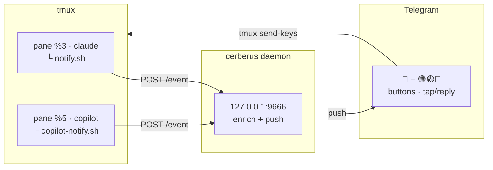

# 🐕‍🦺 Cerberus

**Manage and approve Claude Code and GitHub Copilot CLI sessions remotely from your phone via Telegram and tmux.**

> Your company won't enable remote control? No problem — Cerberus is your
> three-headed guard dog, and it works the night shift for free. 🐕‍🦺

Run your AI coding sessions inside `tmux`. When a session needs you — a
permission prompt, waiting for input — Cerberus pushes a Telegram notification.
From your phone you **approve / deny**, or **type a prompt** that lands in the
right session. Every pending command is tagged with a risk icon
🟢 🟡 🔴 so you know what you're approving.



---

## Why

If you juggle multiple AI coding sessions in a terminal multiplexer, you can't
watch them all. Cerberus lets you step away: it tells you when a session needs
attention, *what* it's asking, and *how risky* it is — and lets you answer
remotely. Claude Code and GitHub Copilot CLI sessions can run side by side;
each notification routes back to its own tmux pane.

---

## How it works

1. A hook fires when a session needs attention:
   - **Claude Code** — the `Notification` hook (`hooks/notify.sh`).
   - **Copilot CLI** — the `notification` hook (`hooks/copilot-notify.sh`);
     a companion `preToolUse` hook caches the tool about to run, since
     Copilot's notification payload doesn't include it.
2. The hook runs **inside the tmux pane**, so it inherits `$TMUX_PANE` (and,
   for Claude, `$CLAUDE_CONFIG_DIR`). It POSTs the event to the local
   **daemon** (`127.0.0.1:9666`).
3. The daemon enriches the event — for Claude it reads the session transcript
   (pending tool + last assistant message), for Copilot it reads the
   `preToolUse` cache — classifies the risk, and pushes a **Telegram** message.
4. Button taps and replies come back through the bot; the daemon routes them to
   the originating pane with **`tmux send-keys`**.

Multiple Claude accounts are supported: the profile label is derived from
`CLAUDE_CONFIG_DIR`, so sessions from different accounts are distinguishable in
the notification.

---

## Requirements

- **Node.js ≥ 22.18** (runs `.ts` natively — no build step; 23.6+ recommended)
- **tmux** — sessions must run inside tmux panes
- **pnpm** (`corepack enable` or `npm i -g pnpm`)
- A **Telegram bot** ([@BotFather](https://t.me/BotFather)) and your chat id
- Claude Code and/or GitHub Copilot CLI

---

## Install

```bash
git clone <repo> cerberus
cd cerberus
pnpm install
cp .env.example .env   # fill it in (see below)
```

### Environment (`.env`)

```ini
TELEGRAM_BOT_TOKEN=123456:ABC...   # from @BotFather
TELEGRAM_CHAT_ID=123456789         # your chat id (from @userinfobot)
TELEGRAM_ALLOWED_CHATS=            # optional extra chats/groups (csv), for routing
PORT=9666                          # daemon port (loopback only)
```

To get your chat id: DM your bot `/start`, then call
`https://api.telegram.org/bot<TOKEN>/getUpdates` and read `message.chat.id`.

---

## Hook setup — Claude Code (once per account)

Cerberus needs its `Notification` hook registered in **each** Claude Code
config directory you use (one per account). Merge the snippet from
`hooks/claude-hooks.template.json` into `settings.json` in every
`CLAUDE_CONFIG_DIR` (default `~/.claude`). Bake in the absolute path first:

```bash
sed "s|__CERBERUS_DIR__|$PWD|g" hooks/claude-hooks.template.json
```

The template contains:

```json
{
  "hooks": {
    "Notification": [
      {
        "matcher": "",
        "hooks": [
          {
            "type": "command",
            "command": "__CERBERUS_DIR__/hooks/notify.sh"
          }
        ]
      }
    ]
  }
}
```

If the file already has a `hooks` object, add only the `"Notification"` key
inside it — don't overwrite existing hooks. (Unlike Copilot, Claude Code
merges into an existing `settings.json`, so this can't be a drop-in copy.)

## Hook setup — GitHub Copilot CLI (once)

Copilot CLI reads hook configs from `~/.copilot/hooks/*.json`. Generate one
from the template (it bakes in the absolute path to this repo):

```bash
mkdir -p ~/.copilot/hooks
sed "s|__CERBERUS_DIR__|$PWD|g" hooks/copilot-hooks.template.json \
  > ~/.copilot/hooks/cerberus.json
```

Run the command from the cerberus repo root. Restart any running `copilot`
session afterwards — hook configs are loaded at startup.

This registers two hooks:

| Event | Purpose |
|-------|---------|
| `notification` | pushes permission prompts / idle / completed to Telegram |
| `preToolUse` | caches the pending tool + args so the notification can show *what* you're approving |

Both are fire-and-forget and never block or deny anything (the `preToolUse`
script always exits 0 — Copilot treats a non-zero exit from a `preToolUse`
hook as "deny the tool").

> **Note (hooks in general):** both hook scripts are best-effort and
> non-blocking. If the daemon is down they silently no-op and never stall a
> session. If you move or rename the cerberus folder, re-do the hook setup —
> the absolute paths are baked into the configs.

---

## Run

Start the daemon and leave it running (it must stay up to receive
button/reply callbacks):

```bash
pnpm start        # or: pnpm dev (watch mode)
```

Then launch your sessions **inside tmux panes**:

```bash
tmux
# Ctrl-b %  to split
claude            # or your per-account alias (sets CLAUDE_CONFIG_DIR)
copilot           # Copilot CLI works the same way, any pane
```

Sessions outside tmux are ignored on purpose: without a pane there is nothing
to drive remotely with `send-keys`.

---

## Using it from the phone

A notification looks like:

> 📁 **Personale** · `my-project`
> Claude needs your permission to use Bash
>
> 🔴 **Bash**: `rm -rf ./dist && pnpm build`
>
> 💬 Cleaning the build folder before recompiling.

Copilot notifications look the same (profile label `Copilot`, no 💬 line —
Copilot doesn't expose the transcript).

| Action | How |
|--------|-----|
| **Approve** | tap ✅ Approva |
| **Deny** | tap ❌ Nega (sends Escape — safe cancel) |
| **Escape** | tap ⎋ Esc |
| **Send a prompt to a session** | **reply** to that notification with your text |
| **Send a prompt to the last session** | send a plain (non-reply) message |
| **Mute a project** | reply `/mute` (or `/mute 2h`) |
| **Unmute** | reply `/unmute` |
| **List muted** | `/muted` |

`/mute` durations: `90s`, `30m`, `2h`, `1d`. No argument = indefinite. Mute is
per-project (matched by working directory, subfolders included).

With multiple sessions active (Claude + Copilot, or several Claude accounts),
a **non-reply** message goes to the *most recent* session that asked for
attention. To target a specific one, always reply to its notification.

### Button keystrokes

Approve sends option `1` + Enter into the permission dialog. The option order
can change between CLI versions — for **both** agents — so verify once on a
live prompt and tune the per-agent keymap in `src/config.ts` (`actionKeys`)
if needed. Deny intentionally defaults to Escape: picking a wrong digit could
hit "yes, don't ask again".

---

## Per-project config — `.cerberus.json`

Drop a `.cerberus.json` in a project (or any parent folder up to `$HOME`) to
set per-project rules. The daemon reads the nearest one before pushing.

```json
{
  "mute": true,
  "chatId": "-1001234567890",
  "minRisk": "caution",
  "notifyIdle": false
}
```

| Key | Effect |
|-----|--------|
| `mute` | suppress all notifications for this project |
| `chatId` | route this project's notifications to a specific chat/group |
| `minRisk` | only notify at/above this risk (`safe` `caution` `danger`) |
| `notifyIdle` | `false` = only permission requests, no idle/waiting pings |

`chatId` overrides are honored only if the chat is allow-listed via
`TELEGRAM_ALLOWED_CHATS` — a cloned repo can't silently redirect your
notifications. A malformed file is ignored.

Commit it for a team-wide rule, or gitignore it for a personal one.

---

## Risk classifier

Every pending command gets an icon, scanned across the whole pipe/`&&` chain
(highest wins: danger > caution > safe). Rules live in `src/classify.ts`.

| Icon | Level | Examples |
|------|-------|----------|
| 🟢 | safe | `cat`, `ls`, `grep`, `git status/log/diff`, `node -v` |
| 🟡 | caution | `mv`, `cp`, `chmod`, `git commit/push`, `pnpm install`, `curl`, edits |
| 🔴 | danger | `rm`, `sudo`, `dd`, `chmod 777`, `git reset --hard`, `--force`, `curl \| sh`, redirects into system paths |

Shell tools (`Bash` for Claude, `bash`/`shell`/`powershell` for Copilot) are
classified by their command. Other tools are classified by name
(`Read`/`Glob` → safe, `Write`/`Edit` → caution; unknown Copilot tool names
fall back to a read-vs-write heuristic).

---

## Agent-specific notes

### Claude Code
- Notifications are enriched from the session transcript: pending tool +
  the last thing Claude said (the 💬 line).
- Multi-account via `CLAUDE_CONFIG_DIR`; edit `src/profile.ts` to map your
  config dirs to your own labels.

### GitHub Copilot CLI
- No transcript in the hook payload: the pending tool comes from the
  `preToolUse` cache instead. If the cache misses (daemon restarted between
  the two events), the notification still arrives — just without the command
  detail.
- Copilot fires notifications for many lifecycle moments; Cerberus forwards
  only `permission_prompt`, `elicitation_dialog`, `agent_idle` and
  `agent_completed`, and drops the rest (`shell_completed`, …).
- Known upstream bug ([copilot-cli#2586](https://github.com/github/copilot-cli/issues/2586)):
  `permission_prompt` may fire for tools already approved in the session.
  Cerberus' 90s dedupe absorbs most of it; if it still gets noisy, use
  `/mute` or `"minRisk": "danger"` for that project.

---

## Security

- The daemon binds `127.0.0.1` only — never reachable off-host.
- Telegram commands are accepted only from whitelisted chats
  (`TELEGRAM_CHAT_ID` + `TELEGRAM_ALLOWED_CHATS`).
- Hook scripts POST to loopback and swallow all errors; they never execute
  remote input. Remote input flows one way only: Telegram → whitelisted chat →
  `tmux send-keys`.
- Never expose the daemon port publicly. For remote access use a private
  tunnel (Tailscale, Cloudflare Tunnel) — not an open port.

---

## Project layout

```
hooks/notify.sh                     Claude Code Notification hook (curls the daemon)
hooks/claude-hooks.template.json    Claude hook config template (→ settings.json)
hooks/copilot-notify.sh             Copilot CLI hook (notification + preToolUse)
hooks/copilot-hooks.template.json   Copilot hook config template (→ ~/.copilot/hooks/)
src/daemon/index.ts                 HTTP intake + per-agent enrichment + push
src/bot/index.ts                    Telegram push, buttons, replies, /mute
src/registry.ts                     session ↔ pane ↔ message maps
src/tmux.ts                         send-keys / pane-alive helpers
src/transcript.ts                   Claude transcript reader (tool_use + last text)
src/pending-tools.ts                Copilot preToolUse cache
src/classify.ts                     risk classifier
src/profile.ts                      agent + profile labels
src/project-config.ts               .cerberus.json reader
src/mute.ts                         runtime mute-set with TTL
src/config.ts                       env + per-agent action keymaps
```

---

## Development

```bash
pnpm dev          # watch mode
pnpm typecheck    # tsc --noEmit
```

No build step: Node ≥ 23.6 strips TypeScript types natively. `tsc` is
typecheck-only.

When smoke-testing alongside a running instance, use a different `PORT` and
leave `TELEGRAM_BOT_TOKEN` unset — two bots polling the same token make
Telegram return 409.

---

## Status

Claude Code (multi-account) + GitHub Copilot CLI, side by side: push + remote
approve/deny/prompt, risk classifier, per-project config, runtime mute.
Runtime mute is in-memory (cleared on restart). See `ROADMAP.md`.
